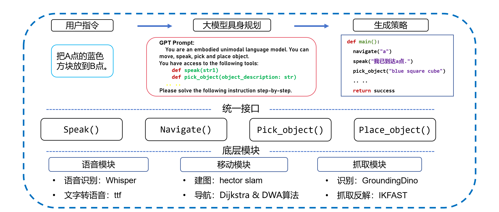

# X3Plus-Embodied
HIT (Shenzhen) 2023 Computer Science Freshman Project: An Embodied Intelligence Path Planning System Based on YahboomCar X3 Plus.
## Structure
The following is the code structure of the project:

## Team Members
The project is developed by the following team members (in alphabetical order):
- Ma Yujie  
- Wei Jie  
- Yang Yanyan  
- Zhou Zhiling  
## Overview
Watch the demo video to understand how it works:  

## Installation
1. Clone the repository:
   ```bash
   cd ~/yahboomcar_ws/src
   git clone https://github.com/zzl410/X3Plus-Embodied.git
   
2. Download models:
   -[GroundingDINO link](https://github.com/IDEA-Research/GroundingDINO)
   -[whisper link](https://github.com/openai/whisper)
   -[TTS](https://github.com/coqui-ai/TTS)
   
3. Recompiling IKFast:
   We have tried both KDL and Trace-IK,neither of these methods could provide fast and accurate solutions.As a result, we chose to use IKFast for better performance and reliability.
   ```bash
   sudo apt-get install ros-melodic-moveit-kinematics
   source ~/yahboomcar_ws/devel/setup.bash
   cd ~/yahboomcar_ws
   catkin_make
   
   
